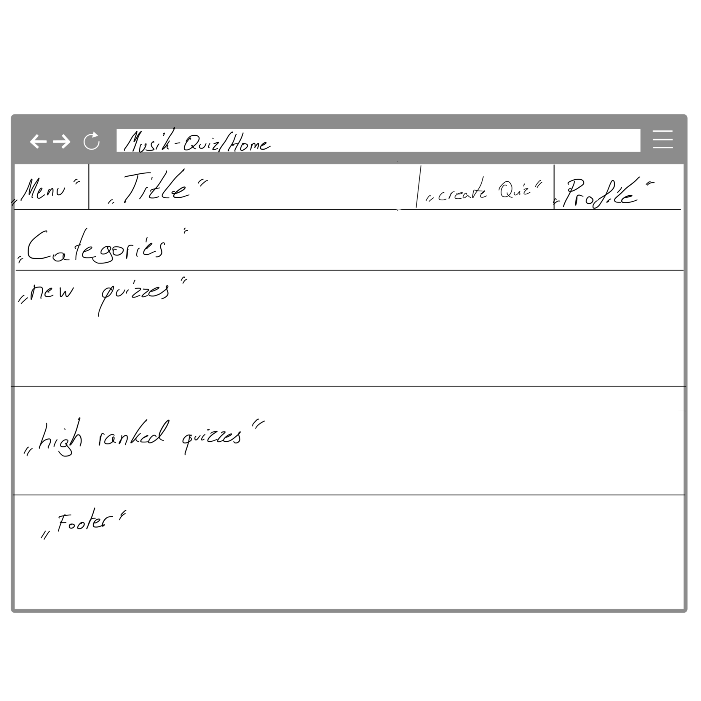
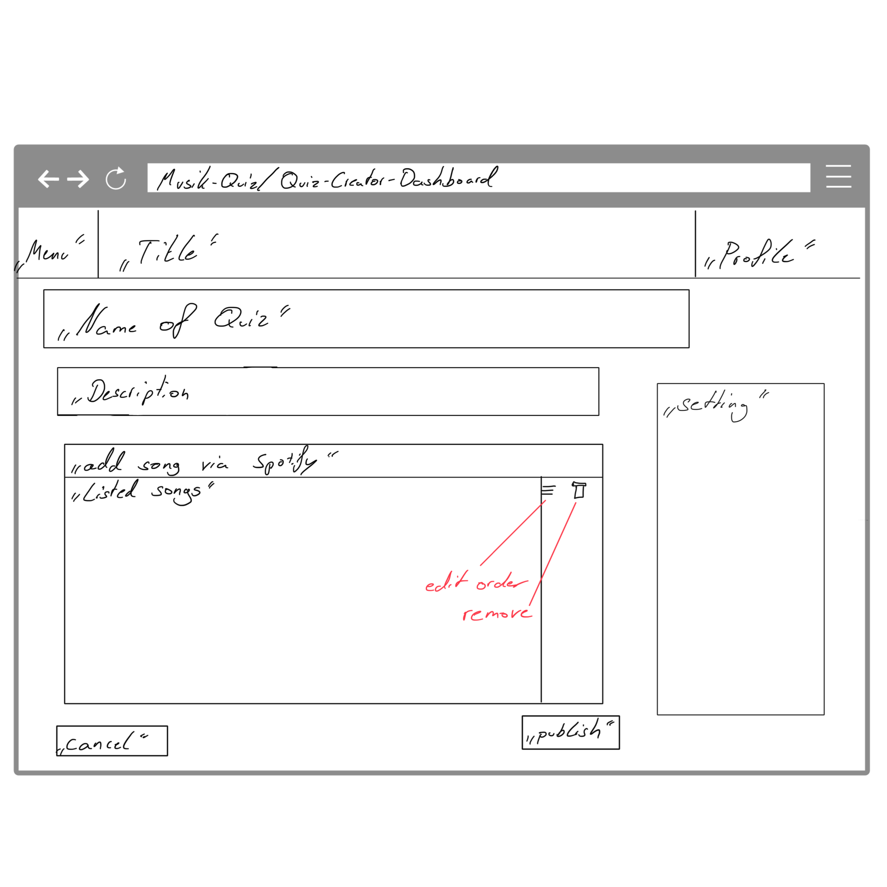
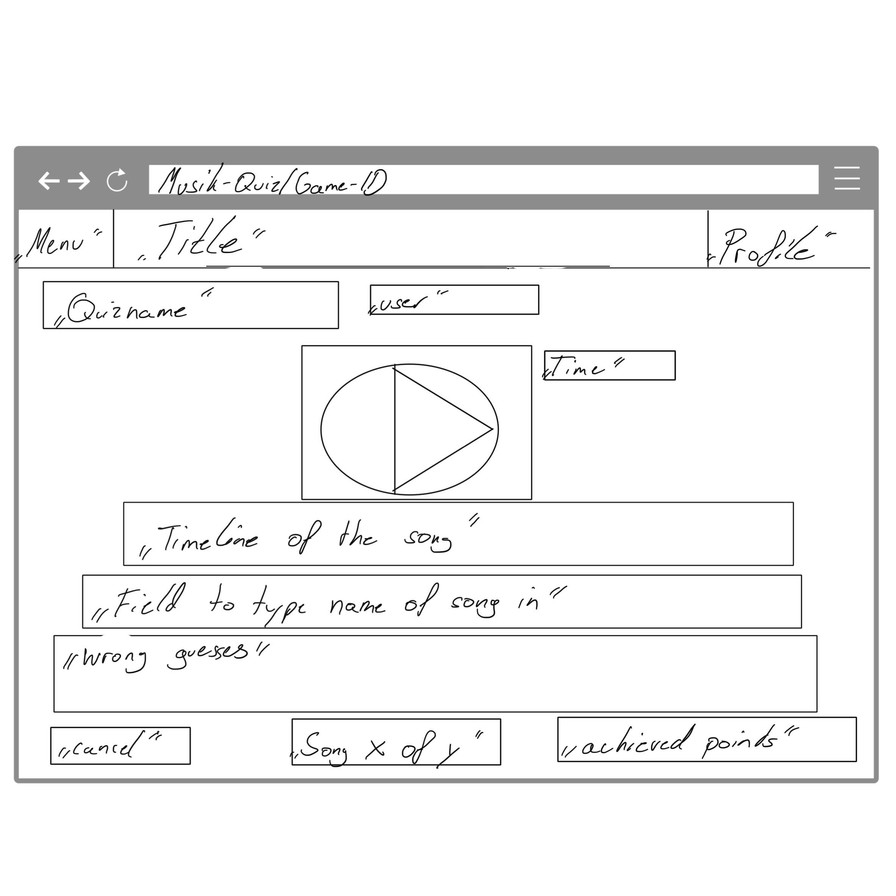
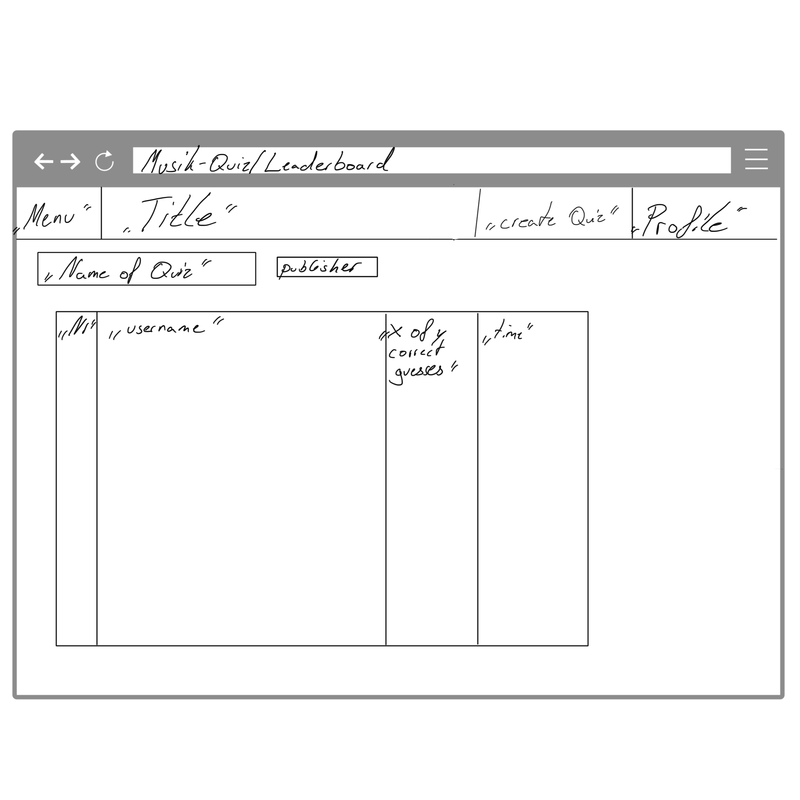

# Musik-Quiz

1. Team Composition
1.1 Gruppenname: „Music competitors“
1.2 Gruppenmitglieder: 
   Paul Pfeiffer (77203983024),
   Leo Harnoth (),
   Daniel Silbermann (),
   Alessio Steinike ()

1.3 Meta-Goals:
- Target Grade: 1.7
- Personal Goals: Sicherer Umgang mit APIs(OAuth2 Spotify Login), Umsetzung einer App mit Frontend und Backend, Sicherer Umgang mit Creator-views

2. Value Proposition
2.1 Target User:
  - Musik-Experten-Communities, die ihr Wissen in Nischen-Genres in Form von Quizzes testen wollen
  - Gruppen, die sich in Gesellschaft oder als Spiel messen wollen
    
2.2 Plausible Problem:
  - Bestehende Musik-Quizze sind oft zu oberflächlich oder decken spezielle Musikrichtungen nicht ab
  - Bei einem einfachen Quiz (z. B. über Youtube) gibt es keine Möglichkeit seine Erfolge zu teilen und sich direkt mit anderen Nutzern zu konkurrieren
  - Player von Musik Quizzen können in der Regel nicht einfach ein eigenes Quiz erstellen und es veröffentlichen
    
2.3 Solution:
  - Eine Plattform, auf der Experten (Quiz-Master) maßgeschneiderte Audio-Quizze erstellen können, die von der Community (Player) gelöst werden
  - Player können Erfolge sharen um eine kompetetive Dynamik zu kreiieren
  - Langfristige Einführung von Funktionen für virtuelle Wettbewerbe über die Webapp
  - Player können über eine Spotify API einfach eigene Quizze erstellen und diese in der Webapp veröffentlichen

2.4 Two-Sided Platform:
Seite A: Der „Quiz-Master“ (Creator)
Aktion: Erstellt eigene Quiz-Pakete. Er sucht über die Spotify-API nach Songs, stellt ein Set zusammen (z.B. „Best of 90s Techno“) und gibt dem Quiz einen Namen
Ziel: Content erstellen und in Form einer Challenge sehen, wie viele Leute das Quiz erfolgreich abgeschlossen haben

Seite B: Der „Herausforderer“ (Player)
Aktion: Durchsucht die Plattform nach Quiz-Paketen anderer Nutzer und spielt diese
Ziel: Highscores knacken und sich in einer Rangliste verewigen

3. Target Scope
Ansichten:
1. Home/Discovery: Liste der neuesten oder beliebtesten Quiz-Pakete (erstellt von Usern).

2. Quiz-Creator Dashboard: Eine Suchmaske (Spotify API Anbindung), um Songs zu einem eigenen Paket hinzuzufügen

3. Game Interface: Der Player mit dem 30-Sekunden-Snippet, dem Eingabefeld und dem Timer.

4. Leaderboard: Eine Übersicht, welcher User welches Quiz am schnellsten gelöst hat.

